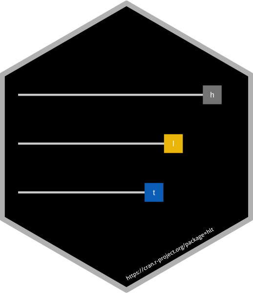

# R package: hlt 

<!-- badges: start -->
[](http://cran.r-project.org/package=rstanarm)
[](http://cran.rstudio.com/package=rstanarm)
[](https://github.com/stan-dev/rstanarm/actions)
<!-- badges: end -->

### Higher-Order Item Response Theory (Latent Trait Theory) with Regression

R package for estimation of higher-order latent trait theory in the context of item response theory. We implement the generalized partial creadit measurent model with a second-order latent trait structure. Latent regression can be done on the second-order latent trait.

Click the arrows for more details:

<details><summary>Quick start guide</summary>

Hello.
</details>

<details><summary>More details</summary>

Hello.
</details>

<details><summary>Modeling</summary>

* [__`stan_jm`__](https://mc-stan.org/rstanarm/reference/stan_jm.html)

   Estimates shared parameter joint models for longitudinal and time-to-event
   (i.e. survival) data. The joint model can be univariate (i.e. one longitudinal
   outcome) or multivariate (i.e. more than one longitudinal outcome). A variety
   of parameterisations are available for linking the longitudinal and event
   processes (i.e. a variety of association structures).

</details>

<details><summary>Estimation</summary>
Hi again
</details>

---

### Resources

* [Learn about MCMC](https://m-clark.github.io/docs/ld_mcmc/index_onepage.html#preface) (MCMC book)
* [Ask a question/ Open an issue](https://github.com/mkleinsa/hlt/issues) (GitHub issues for bug reports, feature requests)

### Installation

#### Latest Release

The most recent **hlt** release can be installed from CRAN via

```r
install.packages("hlt")
```

#### Development Version

The most recent **hlt** development release can be installed from Github via devtools. If you do not have devtools installed on your system, go here to install it.

```r
install.packages("devtools")
```

```r
devtools::install_github("mkleinsa/hlt")
```
### Contributing 

If you are interested in contributing to the development of **hlt** please open an issue to request.

### References and other literature


